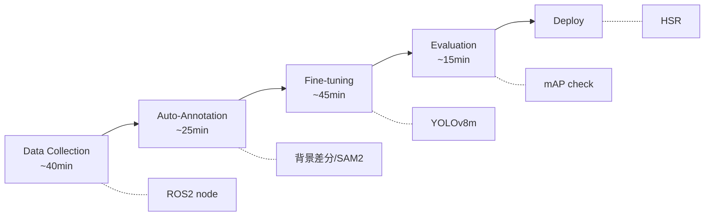

# HSR Perception Pipeline for RoboCup@Home

RoboCup@Home大会向けのHSR（Human Support Robot）用物体認識パイプライン。
大会当日2〜3時間の制約内でデータ収集からモデルデプロイまでを完了させるためのツール群を提供します。

**開発環境**: Ubuntu 22.04 / ROS2 Humble / Python

---

## 大会当日ワークフロー



---

## セットアップ

### 必要環境

| 項目 | 要件 |
|------|------|
| OS | Ubuntu 22.04 |
| Python | 3.10+ |
| GPU | CUDA対応GPU（VRAM 6GB以上推奨） |
| ROS2 | Humble（データ収集機能使用時） |

### 1. Python依存パッケージ

```bash
# 基本パッケージのインストール
pip install -r requirements.txt

# GPU使用時: PyTorch CUDA版をインストール（推奨）
# https://pytorch.org/get-started/locally/ で環境に合ったコマンドを確認
pip install torch torchvision --index-url https://download.pytorch.org/whl/cu121
```

### 2. SAM2のセットアップ（自動アノテーションで使用）

```bash
# SAM2パッケージのインストール
pip install git+https://github.com/facebookresearch/segment-anything-2.git

# SAM2モデルのダウンロード（Base Plusを推奨）
# models/ ディレクトリに配置してください
wget -P models https://dl.fbaipublicfiles.com/segment_anything_2/092824/sam2.1_hiera_base_plus.pt
```

**利用可能なSAM2モデル:**
| モデル | サイズ | 用途 |
|--------|--------|------|
| sam2.1_hiera_tiny.pt | 最小 | 高速処理優先 |
| sam2.1_hiera_small.pt | 小 | バランス型 |
| sam2.1_hiera_base_plus.pt | 中（推奨） | 精度と速度のバランス |
| sam2.1_hiera_large.pt | 大 | 高精度優先 |

### 3. YOLOモデルの事前取得（オプション）

Ultralyticsは初回実行時に自動ダウンロードしますが、オフライン環境に備えて事前取得を推奨します。

```bash
python -c "from ultralytics import YOLO; YOLO('yolov8m.pt')"
```

### 4. ROS2パッケージのビルド（データ収集機能使用時）

```bash
cd src
colcon build --packages-select hsr_perception
source install/setup.bash
```

---

## 使い方

### GUIアプリ（推奨）

Streamlitベースの統合GUIで、全工程を操作できます。

```bash
./run_app.sh
# または
streamlit run app/main.py
```

ブラウザで http://localhost:8501 を開いてください。

**機能:**
- Dashboard - パイプライン全体の進捗・状態可視化
- Registry - オブジェクト登録・参照画像管理
- Collection - データ収集（ROS2/ローカルカメラ/ファイル）
- Annotation - 自動アノテーション実行
- Training - YOLOv8 fine-tuning・進捗監視
- Evaluation - モデル評価・可視化テスト

### CLIスクリプト

#### Step 1: クラス設定
`config/object_classes.json` を大会で配布されたオブジェクトリストに合わせて編集

#### Step 2: データ収集（ROS2使用時）
```bash
# 連続撮影ノードの起動
ros2 launch hsr_perception capture.launch.py

# クラス設定・バースト撮影
ros2 service call /continuous_capture/set_class hsr_perception/srv/SetClass "{class_id: 0}"
ros2 service call /continuous_capture/start_burst hsr_perception/srv/StartBurst "{num_images: 100, interval_seconds: 0.2}"
```

#### Step 3: 自動アノテーション
```bash
# 背景差分方式（推奨・高速）
python scripts/annotation/auto_annotate.py \
    --method background \
    --background datasets/backgrounds/white_sheet.jpg \
    --input-dir datasets/raw_captures \
    --output-dir datasets/competition_day \
    --class-config config/object_classes.json

# SAM2方式（フォールバック・GPU必要）
python scripts/annotation/auto_annotate.py \
    --method sam2 \
    --input-dir datasets/raw_captures \
    --output-dir datasets/competition_day \
    --class-config config/object_classes.json
```

#### Step 4: Fine-tuning
```bash
# 競技用設定でYOLOv8mをfine-tuning
python scripts/training/quick_finetune.py \
    --dataset datasets/competition_day/data.yaml \
    --model yolov8m.pt \
    --output models/finetuned

# 高速モード（小さいモデル）
python scripts/training/quick_finetune.py \
    --dataset datasets/competition_day/data.yaml \
    --fast
```

#### Step 5: 評価
```bash
# モデル評価（mAP、推論時間）
python scripts/evaluation/evaluate_model.py \
    --model models/finetuned/competition_*/weights/best.pt \
    --dataset datasets/competition_day/data.yaml

# 可視化検証
python scripts/evaluation/visual_verification.py \
    --model models/finetuned/competition_*/weights/best.pt \
    --batch-dir datasets/competition_day/images/val
```

---

## ディレクトリ構成

```
hsr-perception-robocup/
├── app/                    # Streamlit GUIアプリ
│   ├── main.py             # メインエントリーポイント
│   ├── pages/              # 各ページ（Registry, Collection, etc.）
│   ├── services/           # バックエンドサービス
│   └── components/         # 共有UIコンポーネント
│
├── scripts/                # CLIスクリプト
│   ├── common/             # 共通ユーティリティ
│   ├── capture/            # キャプチャツール
│   ├── annotation/         # 自動アノテーション
│   ├── training/           # 学習パイプライン
│   └── evaluation/         # 評価ツール
│
├── src/hsr_perception/     # ROS2パッケージ
│   ├── hsr_perception/     # ノード実装
│   ├── srv/                # サービス定義
│   └── launch/             # Launchファイル
│
├── config/                 # 設定ファイル
│   └── object_classes.json # クラス定義
│
├── docs/                   # ドキュメント
├── models/                 # 学習済みモデル（.gitignore）
├── datasets/               # データセット（.gitignore）
└── profiles/               # 競技プロファイル
```

各ファイルの詳細は [docs/implementation.md](docs/implementation.md) を参照してください。

---

## 技術スタック

| カテゴリ | 技術 |
|---------|------|
| 物体検出 | YOLOv8 (Ultralytics) |
| セグメンテーション | SAM2 (Meta) |
| GUI | Streamlit |
| ロボティクス | ROS2 Humble, cv_bridge |

---

## ドキュメント

- [アプリガイド（日本語）](docs/app_guide.md)
- [App Guide (English)](docs/app_guide_en.md)
- [実装リファレンス](docs/implementation.md)
- [設定リファレンス](docs/configuration.md)

---

## 参考資料

- [RoboCup@Home Rulebook](https://github.com/RoboCupAtHome/RuleBook)
- [Ultralytics YOLOv8 Docs](https://docs.ultralytics.com/)
- [Segment Anything 2](https://github.com/facebookresearch/sam2)
