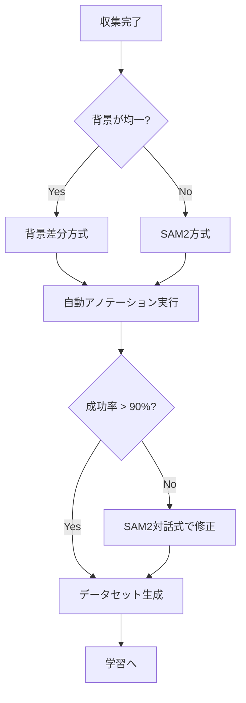

# Annotation - 自動アノテーション

収集画像から自動でバウンディングボックスを生成し、YOLO形式のデータセットを作成。

---

## 関連ファイル

| ファイル | 説明 |
|---------|------|
| `scripts/annotation/auto_annotate.py` | メインパイプライン |
| `scripts/annotation/background_subtraction.py` | 背景差分アノテーター |
| `scripts/annotation/sam2_annotator.py` | SAM2アノテーター |
| `scripts/annotation/sam2_interactive_app.py` | SAM2対話式GUI |
| `scripts/annotation/annotation_utils.py` | YOLO形式変換ユーティリティ |
| `scripts/annotation/prepare_dataset.py` | データセット準備 |
| `scripts/annotation/video_tracking_predictor.py` | 動画トラッキング |
| `app/pages/4_Annotation.py` | Streamlit UIページ |

---

## 使用技術

- **OpenCV** - 画像処理（背景差分、輪郭検出）
- **SAM2 (Segment Anything 2)** - セグメンテーションモデル
- **PyTorch** - 深層学習フレームワーク
- **Tkinter** - 対話式GUI

---

## アノテーション方式

### 1. 背景差分方式（推奨）

**特徴:**
- 高速処理（大会当日向け）
- 均一背景が必要（白シート推奨）
- GPU不要

**アルゴリズム:**
```
背景画像読み込み
    ↓
グレースケール変換 + ガウシアンブラー
    ↓
背景との差分計算
    ↓
閾値処理（Otsu/Adaptive/Fixed）
    ↓
モルフォロジー演算（収縮→膨張）
    ↓
最大輪郭の検出
    ↓
バウンディングボックス生成
    ↓
YOLO形式で保存
```

**設定パラメータ:**

| パラメータ | デフォルト | 説明 |
|-----------|-----------|------|
| `min_contour_area` | 500 | 最小輪郭面積（ピクセル） |
| `blur_kernel_size` | 5 | ブラーカーネルサイズ |
| `threshold_method` | "otsu" | 閾値方式（otsu/adaptive/fixed） |
| `morph_kernel_size` | 5 | モルフォロジーカーネルサイズ |
| `bbox_margin_ratio` | 0.02 | BBoxマージン（2%） |

### 2. SAM2方式（フォールバック）

**特徴:**
- 高精度セグメンテーション
- 複雑な背景に対応
- GPU必要（CUDA）

**設定パラメータ:**

| パラメータ | デフォルト | 説明 |
|-----------|-----------|------|
| `model_path` | "sam2_b.pt" | SAM2モデルパス |
| `points_per_side` | 32 | グリッドポイント数 |
| `pred_iou_thresh` | 0.88 | IoU閾値 |
| `stability_score_thresh` | 0.92 | 安定性スコア閾値 |
| `min_mask_region_area` | 100 | 最小マスク面積 |

### 3. SAM2対話式（GUI）

**特徴:**
- ポイントクリックで対話的にセグメンテーション
- 前景/背景ポイントで精度向上
- 動画トラッキングにも対応

**キーボード操作:**

| 操作 | 機能 |
|-----|------|
| 左クリック | 前景ポイント追加 |
| 右クリック | 背景ポイント追加 |
| Enter | 確定して保存 |
| Escape | ポイントリセット |
| Ctrl+Z | アンドゥ |
| ←/→ | 画像ナビゲーション |
| Space/M | マスクオーバーレイ切替 |
| S | スキップ |

---

## CLI使用方法

### 背景差分方式

```bash
python scripts/annotation/auto_annotate.py \
    --method background \
    --background datasets/backgrounds/white_sheet.jpg \
    --input-dir datasets/raw_captures \
    --output-dir datasets/competition_day \
    --class-config config/object_classes.json
```

### SAM2方式

```bash
python scripts/annotation/auto_annotate.py \
    --method sam2 \
    --input-dir datasets/raw_captures \
    --output-dir datasets/competition_day \
    --class-config config/object_classes.json
```

### 対話式GUI

```bash
python scripts/annotation/sam2_interactive_app.py \
    --input-dir datasets/raw_captures/bottle \
    --output-dir datasets/annotated/bottle \
    --class-id 0
```

---

## 出力形式

### YOLO形式ラベル（.txt）

```
<class_id> <x_center> <y_center> <width> <height>
```

- 座標はすべて0〜1に正規化
- 1行1オブジェクト
- ファイル名は画像と同名（例: image.jpg → image.txt）

### ディレクトリ構造

```
output_dir/
├── images/
│   ├── train/     # 学習用画像（85%）
│   └── val/       # 検証用画像（15%）
├── labels/
│   ├── train/     # 学習用ラベル
│   └── val/       # 検証用ラベル
├── data.yaml      # YOLOデータセット設定
└── annotation_report.json  # 処理レポート
```

### data.yaml形式

```yaml
path: /absolute/path/to/dataset
train: images/train
val: images/val
nc: 5                    # クラス数
names:
  0: bottle
  1: cup
  2: box
  3: snack
  4: fruit
```

---

## アノテーションレポート

```json
{
  "timestamp": "2024-12-08 10:30:45",
  "method": "background",
  "total_classes": 5,
  "total_images": 250,
  "successful": 242,
  "failed": 8,
  "success_rate": 96.8,
  "train_count": 205,
  "val_count": 37,
  "class_results": {
    "bottle": {
      "total": 50,
      "successful": 48,
      "failed": 2,
      "success_rate": 96.0
    }
  }
}
```

---

## 座標変換

### YOLO → ピクセル座標

```python
x_min = (x_center - width/2) * img_width
y_min = (y_center - height/2) * img_height
x_max = (x_center + width/2) * img_width
y_max = (y_center + height/2) * img_height
```

### ピクセル座標 → YOLO

```python
x_center = (x_min + x_max) / 2 / img_width
y_center = (y_min + y_max) / 2 / img_height
width = (x_max - x_min) / img_width
height = (y_max - y_min) / img_height
```

---

## 大会当日のワークフロー



**目標時間**: 25分以内
