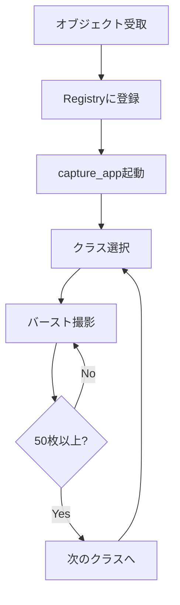

# Collection - データ収集

ROS2カメラトピックからの画像収集。単発撮影、バースト撮影、動画録画に対応。

---

## 関連ファイル

| ファイル | 説明 |
|---------|------|
| `scripts/capture/capture_app.py` | Tkinter GUI（バースト/単発撮影） |
| `scripts/capture/record_app.py` | 動画録画アプリ |
| `scripts/capture/burst_capture.py` | CLIバースト撮影 |
| `scripts/capture/capture_frame.py` | 単発フレーム撮影 |
| `scripts/capture/preview_window.py` | プレビューウィンドウ |
| `src/hsr_perception/hsr_perception/continuous_capture_node.py` | ROS2ノード |
| `src/hsr_perception/srv/SetClass.srv` | クラス設定サービス |
| `src/hsr_perception/srv/StartBurst.srv` | バースト開始サービス |
| `src/hsr_perception/srv/GetStatus.srv` | 状態取得サービス |

---

## 使用技術

- **ROS2 Humble** - ロボットミドルウェア
- **OpenCV** - 画像処理
- **Tkinter** - GUI
- **NumPy** - 配列操作

---

## キャプチャモード

### 1. 単発撮影
現在のフレームを1枚保存

### 2. バースト撮影
指定間隔で連続撮影（デフォルト: 0.2秒間隔、50枚）

### 3. 動画録画
MP4動画を録画し、後から均等にフレーム抽出

---

## GUIアプリ（capture_app.py）

### 機能
- リアルタイムカメラプレビュー（中央にレティクル表示）
- ROS2トピック選択
- Registryからクラス選択
- カウントダウンタイマー（3秒）
- 進捗バー表示

### 起動方法

```bash
# ROS2環境をsource済みで実行
python scripts/capture/capture_app.py
```

### キーボード操作

| キー | 機能 |
|-----|------|
| Space | 単発撮影 |
| Enter | バースト開始 |
| Escape | バースト停止 |

---

## ROS2ノード

### サービス

```bash
# クラス設定
ros2 service call /continuous_capture/set_class \
    hsr_perception/srv/SetClass "{class_id: 0}"

# バースト撮影開始
ros2 service call /continuous_capture/start_burst \
    hsr_perception/srv/StartBurst "{num_images: 100, interval_seconds: 0.2}"

# バースト停止
ros2 service call /continuous_capture/stop_burst std_srvs/srv/Empty

# 状態取得
ros2 service call /continuous_capture/get_status \
    hsr_perception/srv/GetStatus
```

### 起動

```bash
# ROS2パッケージビルド後
ros2 launch hsr_perception capture.launch.py
```

---

## 設定パラメータ

### バースト撮影

| パラメータ | デフォルト | 説明 |
|-----------|-----------|------|
| `num_images` | 50 | 撮影枚数 |
| `interval_seconds` | 0.2 | 撮影間隔（秒） |

### 画像保存

| パラメータ | デフォルト | 説明 |
|-----------|-----------|------|
| `jpeg_quality` | 95 | JPEG圧縮品質 |

---

## 出力形式

### ファイル名形式

```
<class_name>_YYYYMMDD_HHMMSS_ffffff.jpg
```

- `class_name`: オブジェクト名
- `YYYYMMDD_HHMMSS`: 日時
- `ffffff`: マイクロ秒（一意性確保）

### ディレクトリ構造

```
raw_captures/
└── <class_name>/
    ├── <class_name>_20241208_103045_123456.jpg
    ├── <class_name>_20241208_103045_323456.jpg
    └── ...

videos/
└── <class_name>_20241208-10-30.mp4
```

---

## 動画録画（record_app.py）

### 機能
- MP4形式で動画録画
- 録画時間表示（MM:SS形式）
- 後からフレーム抽出可能

### 起動

```bash
python scripts/capture/record_app.py
```

### フレーム抽出

録画した動画から均等にフレームを抽出:

```python
# 動画から50フレームを均等抽出
# 抽出間隔 = 総フレーム数 / 50
```

---

## 画像エンコーディング対応

ROS2 Imageメッセージの以下のエンコーディングをサポート:

- `rgb8` - RGB 8bit
- `bgr8` - BGR 8bit（OpenCVネイティブ）
- `mono8` - グレースケール 8bit
- `16UC1` - 深度画像 16bit
- `32FC1` - 深度画像 32bit float

---

## 大会当日のワークフロー



**目標時間**: 全クラス合計 40分以内
