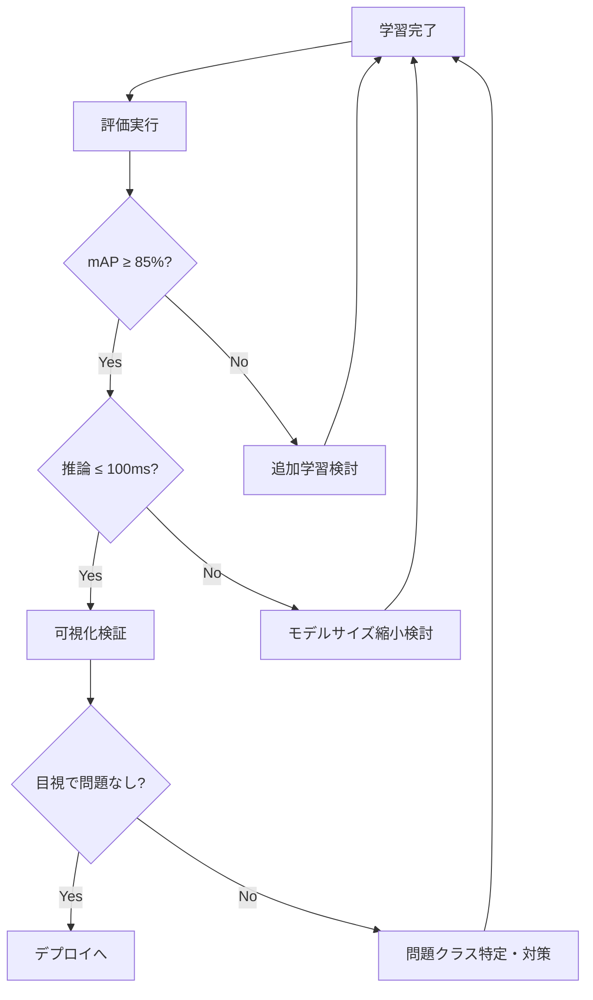

# Evaluation - 評価

モデル精度（mAP）と推論速度の評価。可視化検証、ロバストネステスト、リアルタイムテストに対応。

---

## 関連ファイル

| ファイル | 説明 |
|---------|------|
| `scripts/evaluation/evaluate_model.py` | CLI評価ツール |
| `scripts/evaluation/visual_verification.py` | 可視化検証ツール |
| `scripts/evaluation/xtion_test_app.py` | Xtionリアルタイムテスト |
| `app/pages/6_Evaluation.py` | Streamlit UIページ |
| `app/components/robustness_test.py` | ロバストネステスト |
| `app/components/robustness_augmentation.py` | ロバストネス拡張 |

---

## 使用技術

- **YOLOv8 (Ultralytics)** - 推論・評価
- **OpenCV** - 画像処理・可視化
- **Streamlit** - Web UI
- **Tkinter** - リアルタイムテストGUI
- **Plotly** - グラフ表示

---

## 競技要件

| メトリクス | 目標値 | 説明 |
|-----------|-------|------|
| mAP@50 | ≥ 85% | IoU=0.50での平均精度 |
| 推論時間 | ≤ 100ms | リアルタイム性確保 |

---

## 評価メトリクス

### 全体メトリクス

| メトリクス | 説明 |
|-----------|------|
| mAP@50 | IoU=0.50での平均精度 |
| mAP@50-95 | COCO標準（IoU=0.50〜0.95） |
| Precision | 適合率（TP/(TP+FP)） |
| Recall | 再現率（TP/(TP+FN)） |

### クラス別メトリクス

| メトリクス | 説明 |
|-----------|------|
| AP@50 | クラス別平均精度 |
| F1 Score | 精度と再現率の調和平均 |
| サンプル数 | テスト画像数 |

### 推論時間

- 640x480合成画像で100回測定
- ウォームアップ10回（除外）
- 平均値 ± 標準偏差

---

## CLI使用方法

### モデル評価

```bash
python scripts/evaluation/evaluate_model.py \
    --model models/finetuned/competition_*/weights/best.pt \
    --dataset datasets/competition_day/data.yaml
```

### 可視化検証

```bash
# バッチモード（対話的に画像を確認）
python scripts/evaluation/visual_verification.py \
    --model models/finetuned/competition_*/weights/best.pt \
    --batch-dir datasets/competition_day/images/val

# 単一画像
python scripts/evaluation/visual_verification.py \
    --model models/finetuned/competition_*/weights/best.pt \
    --image path/to/image.jpg
```

### キーボード操作（バッチモード）

| キー | 機能 |
|-----|------|
| n / → | 次の画像 |
| p / ← | 前の画像 |
| s | 結果を保存 |
| q | 終了 |

---

## 評価レポート

### 出力形式

```json
{
  "model_path": "models/finetuned/competition_*/weights/best.pt",
  "dataset_path": "datasets/competition_day/data.yaml",
  "overall_map50": 0.87,
  "overall_map50_95": 0.72,
  "overall_precision": 0.89,
  "overall_recall": 0.83,
  "per_class_metrics": {
    "bottle": {
      "ap50": 0.92,
      "ap50_95": 0.78,
      "precision": 0.94,
      "recall": 0.88,
      "f1_score": 0.91,
      "num_samples": 50
    }
  },
  "inference_time_ms": 45.2,
  "inference_time_std": 3.1,
  "num_test_images": 150,
  "meets_requirements": true
}
```

### コンソール出力例

```
=== Model Evaluation Report ===

Overall Metrics:
  mAP@50:     87.2% [PASS] (target: ≥85%)
  mAP@50-95:  72.1%
  Precision:  89.3%
  Recall:     83.1%

Inference Time:
  Mean:       45.2ms [PASS] (target: ≤100ms)
  Std Dev:    3.1ms

Per-Class Results:
╔══════════╦═══════╦══════════╦═══════════╦════════╦═════════╗
║ Class    ║ AP@50 ║ AP@50-95 ║ Precision ║ Recall ║ Samples ║
╠══════════╬═══════╬══════════╬═══════════╬════════╬═════════╣
║ bottle   ║ 92.1% ║ 78.3%    ║ 94.2%     ║ 88.1%  ║ 50      ║
║ cup      ║ 85.3% ║ 68.2%    ║ 87.1%     ║ 82.3%  ║ 48      ║
╚══════════╩═══════╩══════════╩═══════════╩════════╩═════════╝

✓ All requirements met!
```

---

## ロバストネステスト

### テストモード

1. **リアルタイムプレビュー** - 変換パラメータをスライダーで調整
2. **バッチテスト** - 複数画像に効果を適用
3. **類似オブジェクトテスト** - 類似クラス間の混同確認

### サポートする変換

| 変換 | パラメータ | 説明 |
|-----|-----------|------|
| Brightness | -100 〜 +100 | 明度変化 |
| Shadow | 0 〜 100% | 影の追加 |
| Occlusion | 0 〜 50% | 遮蔽シミュレーション |
| Hue Rotation | 0 〜 180° | 色相回転 |

---

## Xtionリアルタイムテスト

### 起動

```bash
python scripts/evaluation/xtion_test_app.py \
    --model models/finetuned/competition_*/weights/best.pt \
    --confidence 0.5
```

### 機能

- ROS2トピックからリアルタイム推論
- 信頼度閾値スライダー
- FPS表示（30フレーム移動平均）
- 検出リスト表示
- モデル情報パネル

---

## Streamlit UI機能

### タブ構成

| タブ | 機能 |
|-----|------|
| Run Evaluation | データセットでの評価実行 |
| Results History | 過去の評価履歴 |
| Visual Test | 画像アップロードで単発テスト |
| Robustness Test | ロバストネステスト |
| Xtion Live Test | リアルタイムテスト起動 |

---

## 大会当日のワークフロー



**目標時間**: 15分以内

---

## トラブルシューティング

### mAPが目標に達しない場合

1. **データ確認** - アノテーション精度、サンプル数
2. **追加エポック** - patience増加して再学習
3. **データ拡張調整** - 過度な拡張を抑制
4. **モデルサイズ変更** - より大きなモデルを試行

### 推論時間が長い場合

1. **モデル縮小** - yolov8m → yolov8s
2. **画像サイズ縮小** - 640 → 480
3. **バッチサイズ調整** - GPU利用効率最適化
