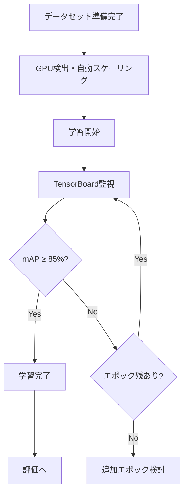

# Training - 学習

YOLOv8モデルのファインチューニング。GPU自動最適化、OOMリカバリー、TensorBoard監視に対応。

---

## 関連ファイル

| ファイル | 説明 |
|---------|------|
| `scripts/training/quick_finetune.py` | メイン学習スクリプト |
| `scripts/training/gpu_scaler.py` | GPU自動スケーリング |
| `scripts/training/training_config.py` | 学習設定管理 |
| `scripts/training/tensorboard_monitor.py` | TensorBoard監視 |
| `app/pages/5_Training.py` | Streamlit UIページ |
| `app/components/training_charts.py` | 学習グラフ表示 |
| `app/services/task_runners/run_training.py` | タスク実行ラッパー |

---

## 使用技術

- **YOLOv8 (Ultralytics)** - 物体検出モデル
- **PyTorch** - 深層学習フレームワーク
- **TensorBoard** - 学習監視
- **CUDA** - GPU演算
- **AMP (Automatic Mixed Precision)** - 混合精度学習

---

## モデル選択

### YOLOv8バリアント

| モデル | パラメータ数 | 推論速度 | 精度 | 推奨用途 |
|-------|------------|---------|-----|---------|
| yolov8n.pt | 3.2M | 最速 | 低 | テスト用 |
| yolov8s.pt | 11.2M | 速い | 中 | 高速モード |
| yolov8m.pt | 25.9M | 中程度 | 高 | **推奨（デフォルト）** |
| yolov8l.pt | 43.7M | 遅い | より高 | 高精度重視 |
| yolov8x.pt | 68.2M | 最遅 | 最高 | ワークステーション用 |

### GPU階層別推奨設定

| GPU階層 | VRAM | モデル | バッチサイズ | 画像サイズ |
|--------|------|-------|------------|-----------|
| Low | <6GB | yolov8s | 8 | 480 |
| Medium | 6-12GB | yolov8m | 16 | 640 |
| High | 12-24GB | yolov8l | 32 | 640 |
| Workstation | >24GB | yolov8x | 64 | 800 |
| CPU-Only | - | yolov8n | 4 | 320 |

---

## CLI使用方法

### 基本的な学習

```bash
python scripts/training/quick_finetune.py \
    --dataset datasets/competition_day/data.yaml \
    --model yolov8m.pt \
    --output models/finetuned
```

### 高速モード（テスト用）

```bash
python scripts/training/quick_finetune.py \
    --dataset datasets/competition_day/data.yaml \
    --fast
```

### GPU自動スケーリング

```bash
python scripts/training/quick_finetune.py \
    --dataset datasets/competition_day/data.yaml \
    --auto-scale
```

---

## 設定パラメータ

### 基本設定

| パラメータ | デフォルト | 説明 |
|-----------|-----------|------|
| `model` | yolov8m.pt | ベースモデル |
| `epochs` | 50 | エポック数 |
| `batch` | 16 | バッチサイズ |
| `imgsz` | 640 | 入力画像サイズ |
| `patience` | 10 | 早期終了の忍耐度 |

### オプティマイザ設定

| パラメータ | デフォルト | 説明 |
|-----------|-----------|------|
| `optimizer` | AdamW | 最適化アルゴリズム |
| `lr0` | 0.001 | 初期学習率 |
| `lrf` | 0.01 | 最終学習率係数 |
| `momentum` | 0.937 | モメンタム |
| `weight_decay` | 0.0005 | 重み減衰 |

### データ拡張

| パラメータ | デフォルト | 説明 |
|-----------|-----------|------|
| `hsv_h` | 0.015 | 色相変化（±1.5%） |
| `hsv_s` | 0.7 | 彩度変化（±70%） |
| `hsv_v` | 0.4 | 明度変化（±40%） |
| `degrees` | 10.0 | 回転（±10度） |
| `translate` | 0.1 | 平行移動（±10%） |
| `scale` | 0.5 | スケール（0.5x〜1.5x） |
| `fliplr` | 0.5 | 水平反転確率 |
| `mosaic` | 1.0 | モザイク拡張確率 |
| `mixup` | 0.1 | MixUp確率 |

### パフォーマンス設定

| パラメータ | デフォルト | 説明 |
|-----------|-----------|------|
| `workers` | 8 | データローダーワーカー数 |
| `cache` | True | 画像をRAMにキャッシュ |
| `amp` | True | 混合精度学習 |
| `close_mosaic` | 10 | 最終Nエポックでモザイク無効 |

---

## 出力ファイル

### ディレクトリ構造

```
models/finetuned/
└── competition_YYYYMMDD_HHMMSS/
    ├── weights/
    │   ├── best.pt          # 最高mAPモデル
    │   ├── last.pt          # 最終エポックモデル
    │   └── epoch*.pt        # 中間チェックポイント
    ├── results.csv          # エポック別メトリクス
    ├── training_result.json # 学習結果サマリー
    └── tensorboard/         # TensorBoardログ
        └── events.out.tfevents.*
```

### results.csv の内容

```csv
epoch,box_loss,cls_loss,dfl_loss,mAP50,mAP50-95,precision,recall
1,1.234,0.567,0.890,0.45,0.32,0.65,0.55
2,1.012,0.456,0.789,0.52,0.38,0.72,0.62
...
```

### training_result.json

```json
{
  "best_model_path": "weights/best.pt",
  "last_model_path": "weights/last.pt",
  "metrics": {
    "mAP50": 0.87,
    "mAP50-95": 0.72,
    "precision": 0.89,
    "recall": 0.83
  },
  "training_time_minutes": 42.5,
  "epochs_completed": 50,
  "tensorboard_url": "http://localhost:6006",
  "config": { ... }
}
```

---

## TensorBoard監視

### 起動

```bash
# 自動起動（学習スクリプトが管理）
python scripts/training/quick_finetune.py --tensorboard

# 手動起動
tensorboard --logdir models/finetuned/competition_*/tensorboard --port 6006
```

### 表示メトリクス

- **Loss**: box_loss, cls_loss, dfl_loss
- **Metrics**: mAP50, mAP50-95, precision, recall
- **Learning Rate**: 学習率推移

---

## OOMリカバリー

GPU メモリ不足時の自動対策:

```
1. バッチサイズを半減
2. 画像サイズを縮小
3. キャッシュを無効化
4. ワーカー数を削減
```

---

## 競技用プリセット

```python
COMPETITION_CONFIG = {
    "model": "yolov8m.pt",
    "imgsz": 640,
    "epochs": 50,
    "batch": 16,
    "patience": 10,
    "optimizer": "AdamW",
    "lr0": 0.001,
    "amp": True,
    "cache": True,
    "close_mosaic": 10,
}
```

---

## 大会当日のワークフロー



**目標時間**: 45分以内
**目標mAP**: ≥ 85%（mAP@50）
